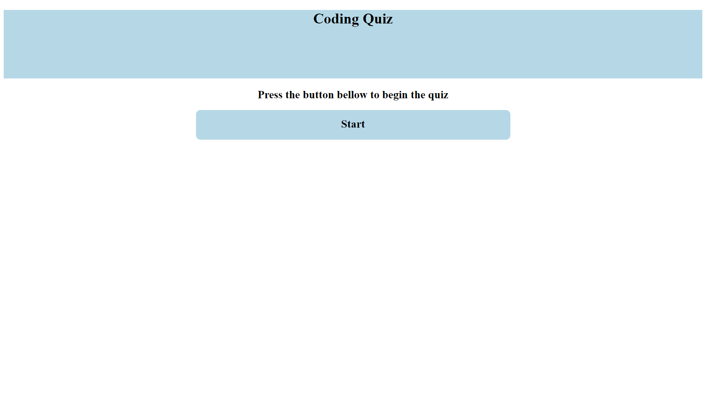

# quiz-homework-4

## Description

Provide a short description explaining the what, why, and how of your project. Use the following questions as a guide:

- What was your motivation?
Learning how to work with a simple API, and improving my understaning of coding logic.

- Why did you build this project? (Note: the answer is not "Because it was a homework assignment.")
To creating a website that will allow the user to answer a short quiz.

- What did you learn?
Not only did I learn a large amount of JS commands; I also learned that if im ever stuck on a bug, cleaning up my code is often the best way to fix it.

## Usage

Go to this link to see the website
https://nathansabin.github.io/quiz-homework-4/ 
https://github.com/nathansabin/quiz-homework-4 

## Features

First off, on the homescreen it renders in a start button and a text box. After clicking the button, the first page will render along with a 30 second timer. If the user answer the question correctly, the next question will load. However if the user answers wrong, five second will be taken of the timer before rendering in the next question. This same log will repeat for all three questions. After answering the question you have an option to enter your intials, if you do then a score board will load in and your data will be added to the bottom (name and amount correct). The bottom of the page has a button that will allow you to try again.

## Tests

All buttons work, your data will be saved without fail, everything renders in properly.

